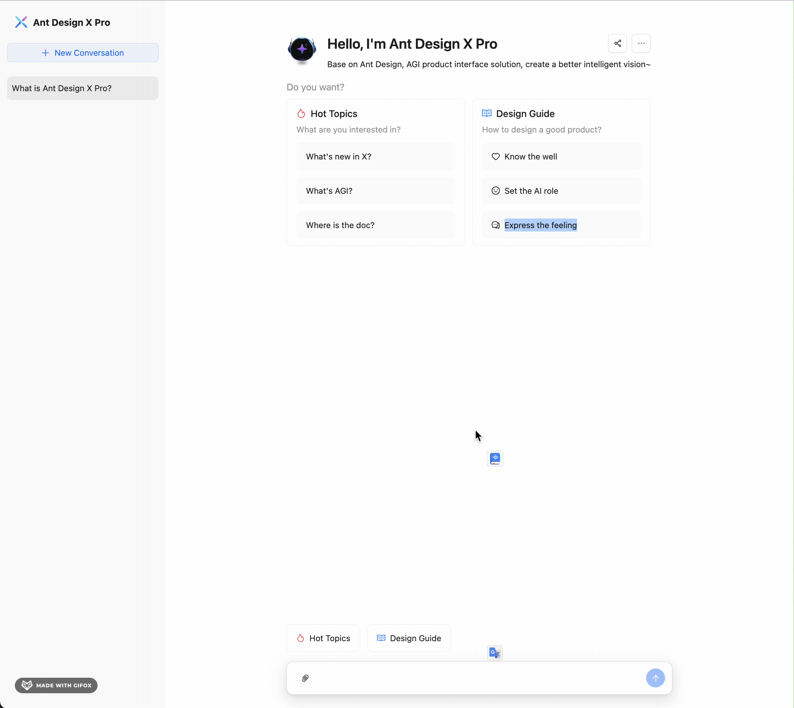

<div align="center">

# Ant Design X Pro

<h4>基于 Ant Design / X 的高级企业级开发框架，集成 AI 能力，让企业开发更智能、更高效</h4>

[English](./README_EN.md) | 简体中文

</div>

## 🎯 项目简介

Ant Design X Pro 是新一代的企业级开发框架，在 Ant Design X 的基础上融入了 AI 能力，提供了更智能的开发体验：




- 🤖 **AI 驱动开发** - 集成智能代码补全、组件推荐、布局优化等 AI 特性
- ⚡️ **开发效率提升** - 智能化的工具链和完善的组件体系，显著提升开发效率
- 🎨 **企业级设计** - 遵循 Ant Design X 设计体系，提供专业的企业级 UI 解决方案
- 🌟 **最佳实践** - 整合了大量企业级项目的开发经验和最佳实践

## ✨ 特性

- 📦 **开箱即用** - 内置完整的企业级应用开发所需的功能模块
- 🎯 **TypeScript** - 使用 TypeScript 开发，提供完整的类型定义
- 🔄 **状态管理** - 集成现代化的状态管理方案
- 🎨 **主题定制** - 灵活的主题配置，支持动态切换
- 📱 **响应式** - 完善的响应式设计，支持多端适配
- 🛡 **权限管理** - 完整的权限控制解决方案
- 🌐 **国际化** - 内置多语言支持
- 📊 **数据可视化** - 丰富的图表组件和数据展示方案

## 📦 安装

```bash
npm create ant-design-x-pro@latest my-project
# 或
yarn create ant-design-x-pro my-project
# 或
pnpm create ant-design-x-pro my-project
```

## 🔧 环境配置

1. 复制环境配置文件:
```bash
cp .env.shadow .env
```

2. 配置环境变量:

在 `.env` 文件中设置以下配置项：

```bash
# AI 服务基础 URL
VITE_BASE_URL=https://dashscope.aliyuncs.com/compatible-mode/v1

# API 密钥
VITE_API_KEY=your-api-key

# AI 响应最大 token 数
VITE_MAX_COMPLETION_TOKENS=100

# 总 token 限制
VITE_MAX_TOKENS=100
```

注意：请确保将 `your-api-key` 替换为您的实际 API 密钥。

## 🚀 快速开始

### 1. 创建项目

```bash
# 创建项目
npm create ant-design-x-pro@latest my-project

# 进入项目目录
cd my-project

# 安装依赖
npm install
```

### 2. 启动开发服务器

```bash
npm start
```

### 3. 构建生产版本

```bash
npm run build
```

## 📚 目录结构

```
├── config/                # umi 配置文件
├── mock/                  # 本地模拟数据
├── public/               # 静态资源
├── src/
│   ├── components/      # 公共组件
│   ├── layouts/         # 布局组件
│   ├── models/          # 全局状态
│   ├── pages/           # 页面组件
│   ├── services/        # 后端服务
│   ├── utils/           # 工具函数
│   ├── access.ts        # 权限定义
│   ├── app.tsx          # 运行时配置
│   └── global.less      # 全局样式
├── tests/               # 测试文件
├── package.json
└── tsconfig.json
```

## 🎯 核心功能

### AI 智能助手

- 智能代码补全
- 组件推荐
- 布局优化建议
- 性能优化提示

### 企业级功能

- 用户认证
- 权限管理
- 数据管理
- 国际化
- 主题定制
- 数据可视化

## 🤝 贡献指南

我们欢迎所有形式的贡献，无论是新功能、文档改进还是 bug 修复。

1. Fork 本仓库
2. 创建特性分支：`git checkout -b feature/AmazingFeature`
3. 提交改动：`git commit -m 'Add some AmazingFeature'`
4. 推送分支：`git push origin feature/AmazingFeature`
5. 提交 Pull Request

## 📝 更新日志

查看 [CHANGELOG.md](./CHANGELOG.md) 了解详细更新历史。

## 🎯 开发计划

- [ ] AI 代码生成增强
- [ ] 微前端架构支持
- [ ] 低代码平台集成
- [ ] 更多数据可视化组件
- [ ] 性能优化工具集成

## 问题

- [ ] 流式响应

## 📄 许可证

本项目采用 MIT 许可证 - 详见 [LICENSE](LICENSE) 文件

## 🙏 致谢

- [Ant Design](https://ant.design)
- [Ant Design X](https://x.ant.design)

## 📮 联系方式

- GitHub：[wxingheng/ant-design-x-pro](https://github.com/wxingheng/ant-design-x-pro)
- 讨论群：[加入讨论](https://github.com/wxingheng/ant-design-x-pro/discussions)

---

如果这个项目对你有帮助，欢迎 star 支持！ ⭐️
